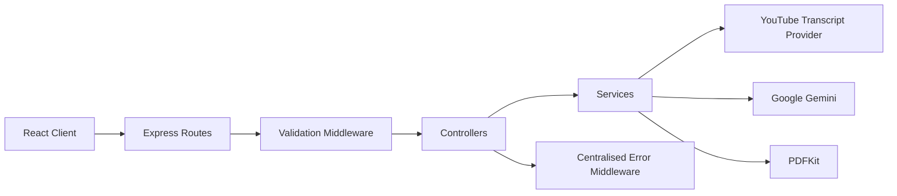

# AI Video Summarizer Backend

[](https://github.com/gulshansharma014/ai-video-summarizer-backend/actions/workflows/backend-ci.yml)

A production-oriented Express API that extracts YouTube transcripts,
generates structured AI-assisted notes using Google Gemini and streams
downloadable PDF documents.

## Features

- YouTube transcript extraction
- Support for regular, shortened, embedded and Shorts URLs
- Gemini-powered transcript analysis
- Streamed PDF generation without temporary files
- Layered route, controller and service architecture
- Centralised request validation
- Structured error responses
- Security headers using Helmet
- General and AI-specific API rate limiting
- Graceful server shutdown
- Unit and API integration tests
- Coverage thresholds enforced in CI
- GitHub Actions validation on supported Node.js versions

## Architecture



## Request Lifecycle

```text
HTTP request
    → Security and CORS middleware
    → Rate limiter
    → Route
    → Request validation
    → Controller
    → Service
    → External provider or PDF stream
    → HTTP response
```

## Project Structure

```text
ai-video-summarizer-backend/
├── .github/
│   └── workflows/
│       └── backend-ci.yml
├── src/
│   ├── config/
│   │   ├── env.js
│   │   ├── gemini.js
│   │   └── rate-limit.js
│   ├── controllers/
│   │   ├── analysis.controller.js
│   │   ├── pdf.controller.js
│   │   └── transcript.controller.js
│   ├── middleware/
│   │   ├── error.middleware.js
│   │   ├── not-found.middleware.js
│   │   └── validation.middleware.js
│   ├── routes/
│   │   ├── analysis.routes.js
│   │   ├── health.routes.js
│   │   ├── pdf.routes.js
│   │   └── transcript.routes.js
│   ├── services/
│   │   ├── analysis.service.js
│   │   ├── pdf.service.js
│   │   └── transcript.service.js
│   ├── utils/
│   │   ├── app-error.js
│   │   └── async-handler.js
│   └── app.js
├── tests/
│   ├── integration/
│   ├── unit/
│   └── setup.js
├── .env.example
├── package.json
├── server.js
├── vitest.config.js
└── README.md
```

## API Endpoints

### Health check

```http
GET /health
```

Example response:

```json
{
  "status": "UP",
  "service": "ai-video-summarizer-backend",
  "timestamp": "2026-07-25T10:30:00.000Z"
}
```

### Extract a transcript

```http
GET /api/transcript?url={youtubeUrl}
```

Example response:

```json
{
  "transcript": "Extracted transcript content..."
}
```

### Analyse a transcript

```http
POST /api/analyze-transcript
Content-Type: application/json
```

Example request:

```json
{
  "transcript": "Transcript content to analyse"
}
```

Example response:

```json
{
  "analyzedTranscript": "Structured AI-generated learning notes..."
}
```

### Download a PDF

```http
POST /api/download-analyzed-pdf
Content-Type: application/json
```

Example request:

```json
{
  "content": "Analysed content to export"
}
```

The endpoint streams an `application/pdf` response directly to the client.

## Error Response Format

All handled API errors use a consistent structure:

```json
{
  "error": "Invalid YouTube URL.",
  "code": "INVALID_YOUTUBE_URL"
}
```

Common status codes:

| Status | Meaning |
|---:|---|
| `400` | Invalid or missing request data |
| `404` | Route or transcript not found |
| `413` | Submitted content exceeds the permitted limit |
| `429` | API rate limit exceeded |
| `502` | External transcript or AI provider failed |
| `500` | Unexpected server failure |

## Technology Stack

| Area | Technology |
|---|---|
| Runtime | Node.js |
| Framework | Express |
| AI Provider | Google Gemini |
| Transcript Provider | `youtube-transcript` |
| PDF Generation | PDFKit |
| Security | Helmet |
| Rate Limiting | `express-rate-limit` |
| Testing | Vitest, Supertest |
| Coverage | V8 coverage provider |
| CI | GitHub Actions |
| Deployment | Render |

## Running Locally

### Prerequisites

- Node.js 20 or later
- npm
- Google Gemini API key

### Installation

```bash
git clone https://github.com/gulshansharma014/ai-video-summarizer-backend.git
cd ai-video-summarizer-backend
npm install
```

Create the environment file:

```bash
cp .env.example .env
```

Update `.env`:

```env
PORT=3000
NODE_ENV=development
GOOGLE_API_KEY=your_google_gemini_api_key
FRONTEND_LIVE_URL=http://localhost:3001
```

Start in development mode:

```bash
npm run dev
```

Start normally:

```bash
npm start
```

The API will run at:

```text
http://localhost:3000
```

## Environment Variables

| Variable | Required | Description |
|---|---:|---|
| `GOOGLE_API_KEY` | Yes | Google Gemini authentication key |
| `PORT` | No | API port, defaulting to `3000` |
| `NODE_ENV` | No | Runtime environment |
| `FRONTEND_LIVE_URL` | No | Permitted frontend CORS origin |

Never commit `.env` files or real API credentials.

## Testing

Run all tests:

```bash
npm test
```

Run tests in watch mode:

```bash
npm run test:watch
```

Run tests with coverage:

```bash
npm run test:coverage
```

The test suite covers:

- Health endpoint behaviour
- YouTube URL parsing
- Request validation
- Transcript and analysis errors
- AI provider success and failure paths
- PDF generation
- Security headers
- Unknown routes
- Structured application errors

Coverage thresholds are enforced during CI.

## Security

The API includes:

- Helmet security headers
- Disabled `X-Powered-By` header
- Restricted CORS configuration
- JSON request-size limits
- Transcript and PDF content limits
- General API rate limiting
- Stricter rate limiting for AI requests
- Centralised error handling
- Environment-based secret management

## Continuous Integration

GitHub Actions runs automatically for pushes and pull requests targeting
`main`.

The workflow:

1. Installs dependencies with `npm ci`.
2. Runs the test suite.
3. Runs coverage validation.
4. Validates the backend using multiple supported Node.js versions.

## Design Decisions

### Layered architecture

Routes, controllers and services have separate responsibilities, making the
application easier to test and extend.

### Direct PDF streaming

Generated PDFs are streamed directly to the response instead of being stored
temporarily on the server. This avoids filesystem dependency and cleanup
problems in cloud environments.

### Defensive validation

Requests are validated at the HTTP boundary, while important service methods
retain their own validation for safe reuse.

### Structured errors

Operational errors include an HTTP status and stable error code so that
clients can handle failures consistently.

## Current Limitations

- Transcript extraction depends on transcript availability.
- Private and restricted videos may not be supported.
- AI processing depends on Gemini API availability and usage limits.
- Authentication and persistent user history are not implemented.
- Very long transcripts are currently rejected instead of processed in chunks.

## Planned Improvements

- [ ] Add Docker and Docker Compose
- [ ] Add transcript chunking for long videos
- [ ] Add configurable analysis formats
- [ ] Add transcript-language selection
- [ ] Add structured logging
- [ ] Add OpenAPI documentation
- [ ] Add authentication and saved analysis history
- [ ] Add Redis-backed distributed rate limiting
- [ ] Add observability and request metrics

## Related Repositories

- [Complete application](https://github.com/gulshansharma014/ai-video-summarizer)
- [React frontend](https://github.com/gulshansharma014/ai-video-summarizer-frontend)

## Author

**Gulshan Kumar**

Software Engineer focused on backend systems, distributed applications and
production-quality software.

- [Portfolio](https://gulshan-dev.vercel.app)
- [LinkedIn](https://www.linkedin.com/in/gulshankumar014)
- [GitHub](https://github.com/gulshansharma014)

## Licence

MIT